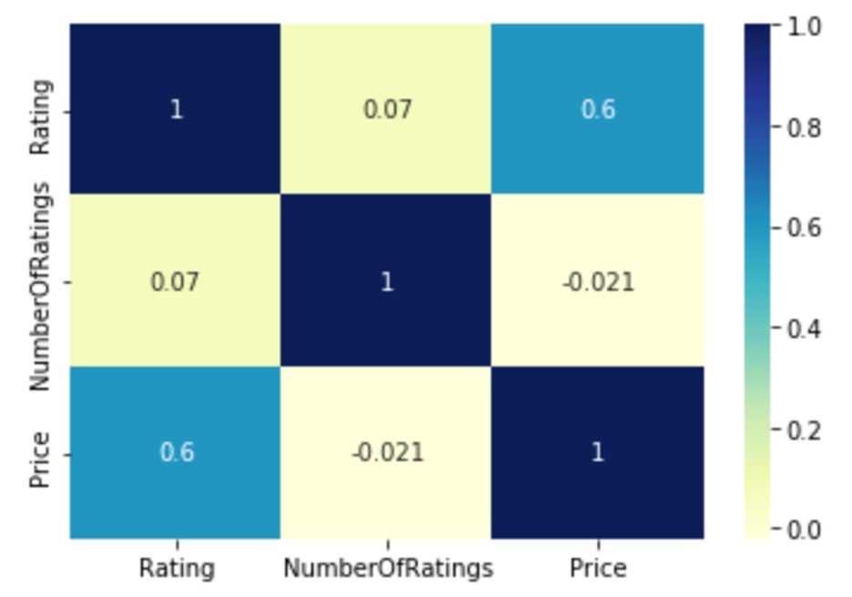
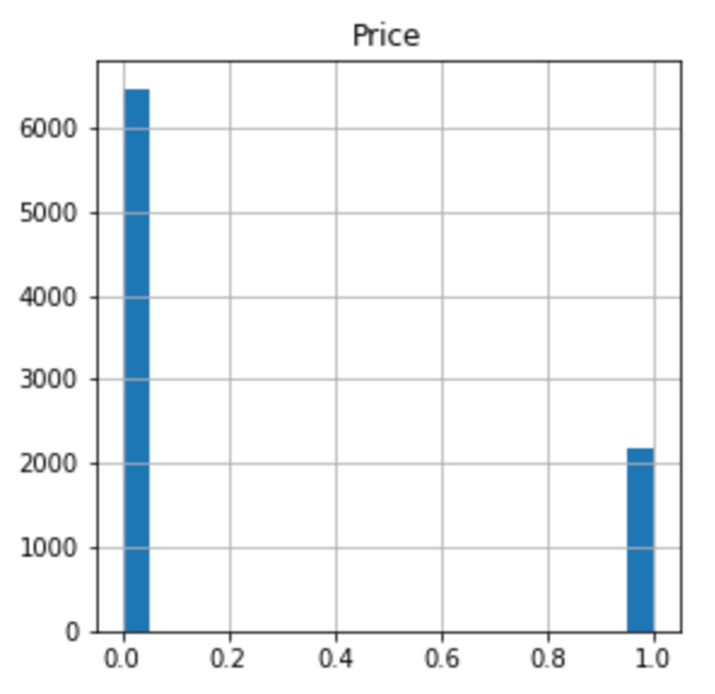
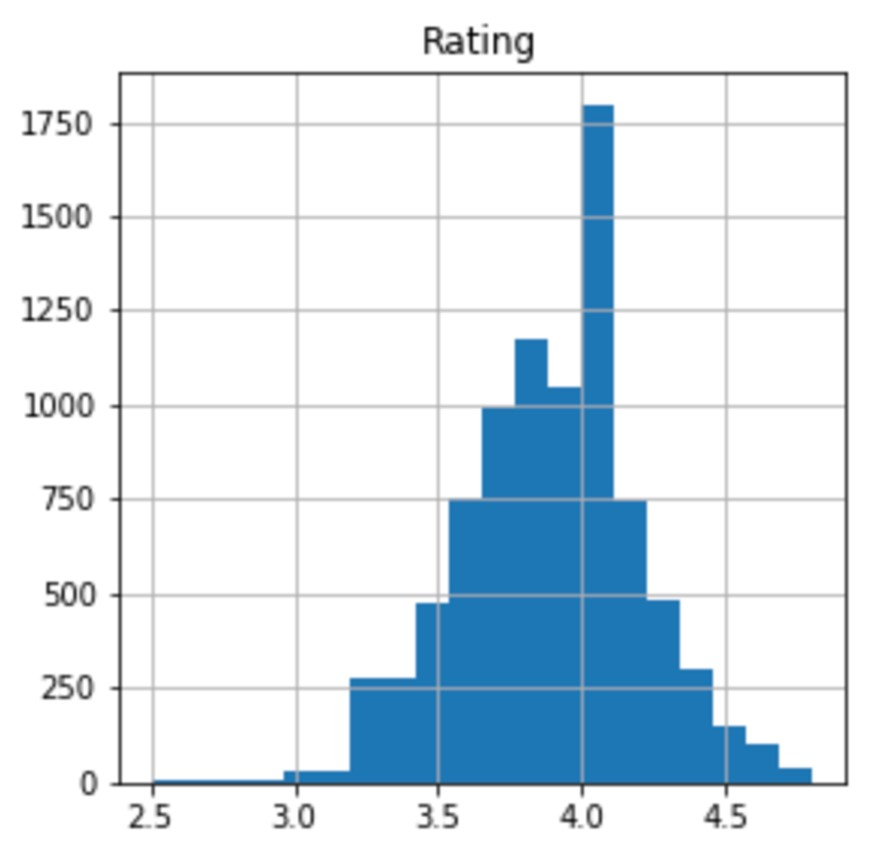
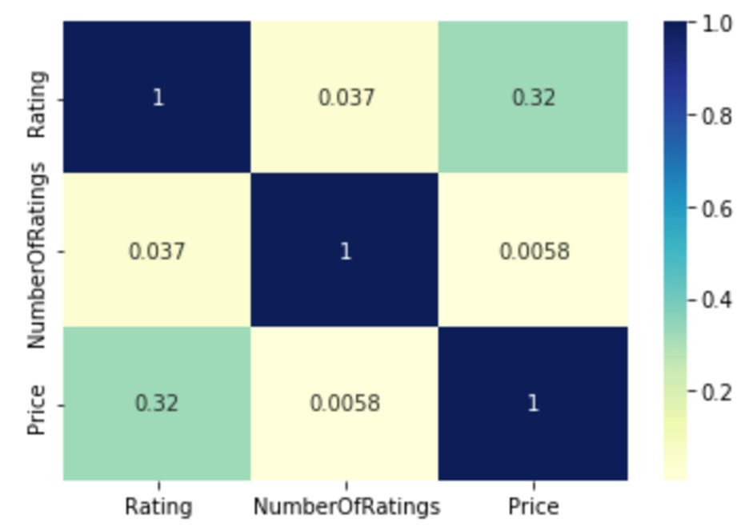
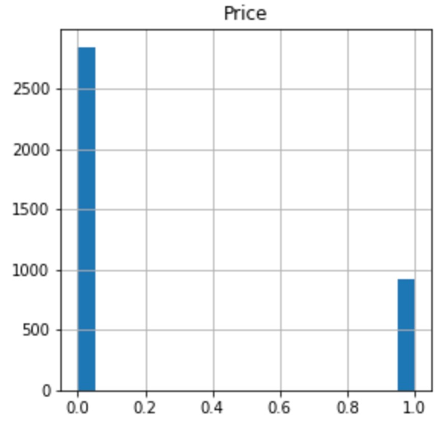
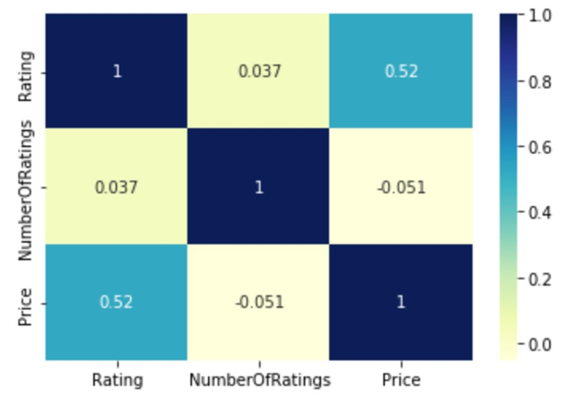
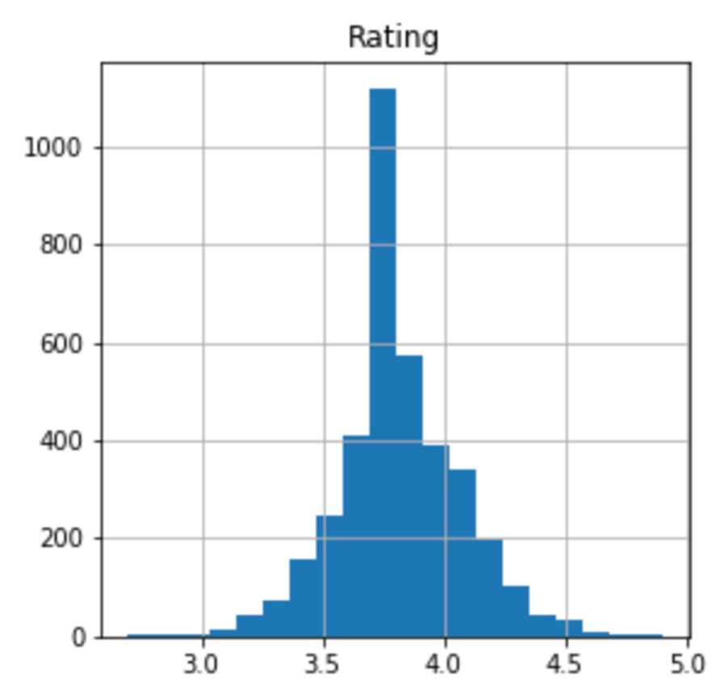
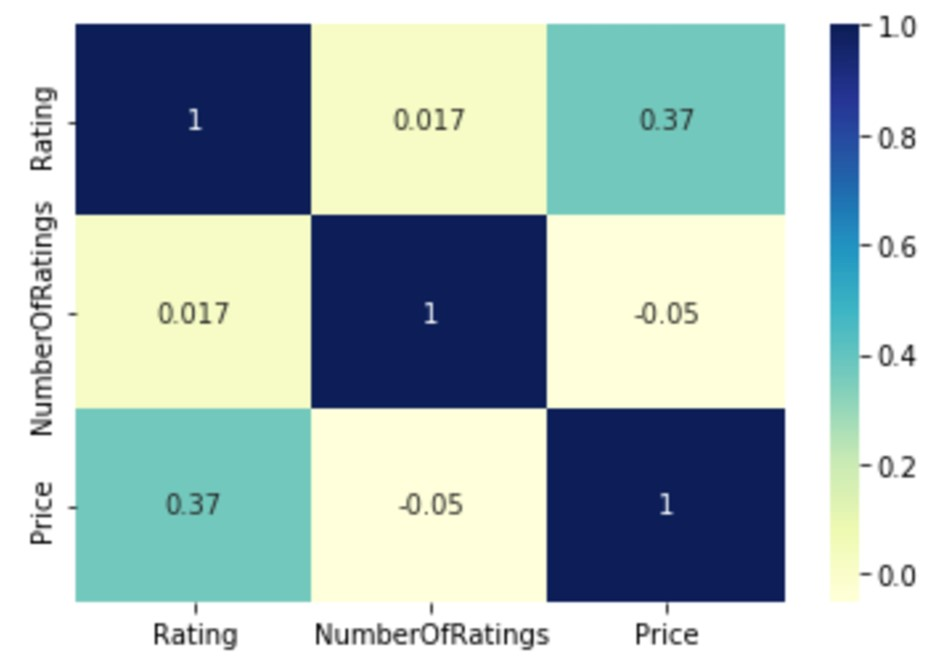

# Group-3-Final-Project
source: https://www.kaggle.com/datasets/budnyak/wine-rating-and-price

## Goal Of Analysis 
The goal of our analysis is to create different models to see which one is the best at predicting the best wines. We ran multiple models with the dependent variable varying between Price, Ratings, and Age. Our goal is to see which is the best predictor. Below are the results that we were able to achieve in our analysis.

## Logistic Regression Red Wine
- **Y Variable:** Price
- **X Variables:** Rating, Number of Ratings, Year

### Model Metrics
- Balanced Accuracy Score: 76.09%
- Cheaper Wines:
  - Precision: 87%
  - Recall: 93%
- Expensive Wines:
  - Precision: 74%
  - Recall: 59%
- Overall Accuracy: 84%

## Logistic Regression Red Wine Continuted
- **Y Variable:** Rating
- **X Variables:** Number of Ratings, Price, Year

### Model Metrics
- Balanced Accuracy Score: 78.03%
- Higher Rated Wines:
  - Precision: 79%
  - Recall: 90%
- Lower Rated Wines:
  - Precision: 83%
  - Recall: 66%
- Overall Accuracy: 80%
  

## Logistic Regression White Wine
- **Y Variable:** Price
- **X Variables:** Rating, Number of Ratings, Year

### Model Metrics
- Balanced Accuracy Score: 74.68%
- Cheaper Wines:
  - Precision: 87%
  - Recall: 95%
- Expensive Wines:
  - Precision: 78%
  - Recall: 54%
- Overall Accuracy: 85%
  

## Logistic Regression White Wine Continuted
- **Y Variable:** Rating
- **X Variables:** Number of Ratings, Price, Year

### Model Metrics
- Balanced Accuracy Score: 71.61%
- Higher Rated Wines:
  - Precision: 81%
  - Recall: 95%
- Lower Rated Wines:
  - Precision: 80%
  - Recall: 48%
- Overall Accuracy: 81%

## Red Wine Logistic Regression with Age Column
### Logistic Regression Model
- Balanced Accuracy: 77.90%
- Cheaper Wines:
  - Precision: 88%
  - Recall: 95%
- Expensive Wines:
  - Precision: 79%
  - Recall: 61%
- Overall Accuracy: 86%

### RandomOverSampler Model
- Balanced Accuracy: 84.03%
- Cheaper Wines:
  - Precision: 94%
  - Recall: 84%
- Expensive Wines:
  - Precision: 63%
  - Recall: 85%
- Overall Accuracy: 84%

### KNN Model
- Accuracy Score: 77.51%

### SVC Model
- Accuracy Score: 75.24%

## White Wine Logistic Regression with Age Column
### Logistic Regression Model
- Balanced Accuracy: 80.45%
- Cheaper Wines:
  - Precision: 90%
  - Recall: 94%
- Expensive Wines:
  - Precision: 78%
  - Recall: 67%
- Overall Accuracy: 87%
  
### RandomOverSampler Model
- Balanced Accuracy: 85.36%
- Cheaper Wines:
  - Precision: 95%
  - Recall: 84%
- Expensive Wines:
  - Precision: 64%
  - Recall: 86%
- Overall Accuracy: 85%
  
### KNN Model
- Accuracy Score: 77.55%
  
### SVC Model
- Accuracy Score: 75.64%

## Tableau
https://public.tableau.com/app/profile/luis.santamaria2414/viz/RedandWhiteWineDataExploration/Story1

## Conclusion 
In conclusion the models calculated with the age column are the best because creating the age column allows for the machine to have another concrete item to take into account. We have determined that logistic regression model was the best when predicting the price of white and red wines.

The logistic regression model did a much better job at predicting the price over predicting the rating. 

## Credits
Team responsible for the formation of this project:
##
Kiana Talavera: (https://github.com/talaverak)

Luis Santamaria: (https://github.com/lsantama3)

Julia Gillas (https://github.com/jgillas)

Joey Sirko: (https://github.com/JoeySirko)

